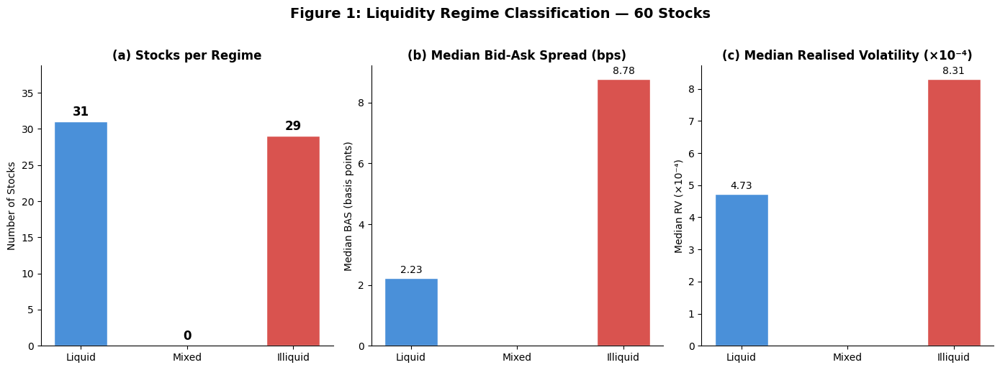
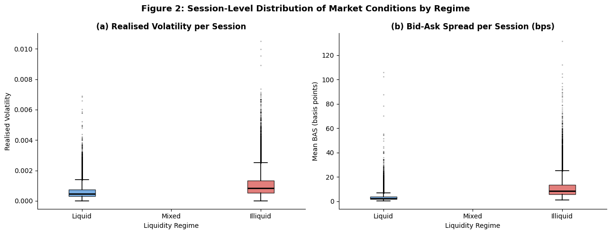
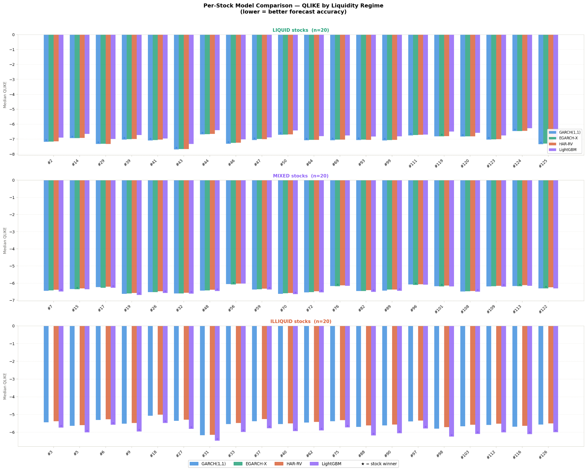
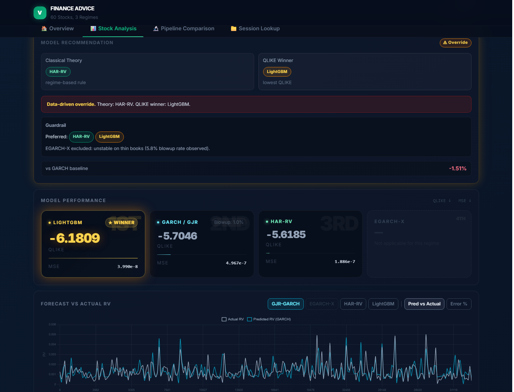
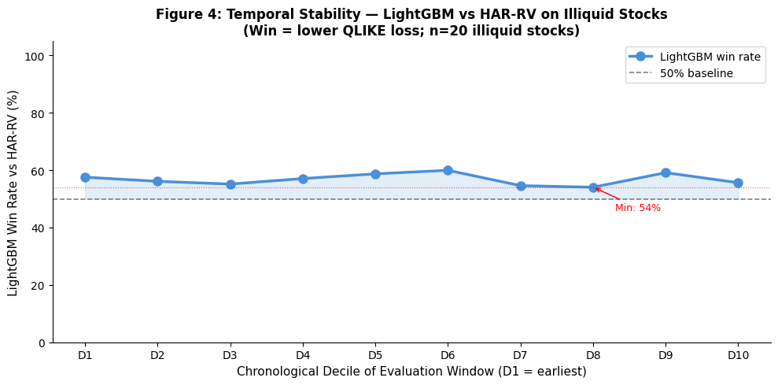

```{python}
#| code-fold: true
#| code-summary: "Setup: imports and paths"
import os, sys, warnings
import numpy as np
import pandas as pd
import matplotlib.pyplot as plt
import matplotlib.gridspec as gridspec
warnings.filterwarnings("ignore")

# ── Paths ─────────────────────────────────────────────────────────────────────
HERE       = os.path.dirname(os.path.abspath("report.qmd"))
OUT_DIR    = os.path.join(HERE, "m4_outputs")
LGBM_OUT   = os.path.join(OUT_DIR, "lgbm_outputs")
PIPELINE   = os.path.join(OUT_DIR, "pipeline")

# Colours consistent with the dashboard
C_LGBM  = "#8B5CF6"
C_GARCH = "#378ADD"
C_EX    = "#1D9E75"
C_HAR   = "#D85A30"
C_SPINE = "#D3D1C7"
REGIME_COLORS = {"liquid": "#10b981", "illiquid": "#f43f5e", "mixed": "#f59e0b"}
```

## Executive Summary

Volatility measures how much an asset price moves over a short period. For a market maker, a poor
volatility forecast has a direct cost: underestimating volatility means spreads are too narrow and
inventory risk increases; overestimating means spreads become uncompetitive. Realized volatility is
difficult to forecast because order-book behaviour changes across liquidity conditions. In liquid
stocks, spreads are tight and prices update frequently. In illiquid stocks, spreads are wider, trading
is thinner, and price movements are noisier. A model that works well in a dense order book may
become unreliable when liquidity deteriorates.

Instead of choosing one universal model, we built a **liquidity-aware model router**. The router
classifies each stock into one of three regimes (liquid, mixed, or illiquid) using a composite score
based on bid-ask spread and order volume, then routes it to the model best suited to that regime. We
compared four model families: GJR-GARCH, EGARCH-X, HAR-RV/WLS, and LightGBM, evaluated
primarily using QLIKE loss.

The central finding is that **no single model dominates across all regimes**. GJR-GARCH wins 19 of 20
liquid stocks, LightGBM wins all 20 illiquid stocks, and mixed stocks split between LightGBM and
EGARCH-X. Across all candidate models, LightGBM is the exact winner in 13 of 20 mixed stocks, while
EGARCH-X wins the other 7. The empirical winner aligns with the recommended model in 52 of 60
stocks, showing that model selection should be treated as a liquidity-dependent decision rather than a
one-time model-ranking exercise.


## Research Question, Aim and Hypothesis

This project asks which volatility forecasting model should be trusted under different liquidity
conditions. More specifically, we studied how a stock's liquidity profile, measured by bid-ask spread
and order-book activity, changes the trade-off between forecast accuracy, model stability, and
interpretability. We hypothesised that GARCH-family models would outperform on liquid stocks, while
machine-learning approaches would outperform on illiquid stocks, because liquidity conditions govern
the stability of parametric distributional assumptions.

The aim was to build a regime-based volatility forecasting pipeline for Optiver, a high-frequency
market maker that needs accurate short-horizon volatility estimates to price risk and set competitive
spreads.


## Background

Volatility is the standard deviation of an asset's returns over a given window. It is latent, time-varying, heavy-tailed, and prone to clustering, turbulent periods tend to follow turbulent ones. It underpins options pricing, risk management frameworks such as Value-at-Risk, and execution decisions around position sizing. Across all three domains, the consequences of mis-estimation are asymmetric: underestimating volatility just before a market spike produces immediate, severe financial damage.

Market makers provide liquidity by continuously quoting bid and ask prices, profiting from the narrow spread between them. Holding temporary inventory exposes them to financial risk if prices move adversely before a matching trade occurs, making accurate short-horizon volatility forecasting an operational necessity. For a global electronic market maker like Optiver, where algorithmic quotes update continuously across hundreds of stocks in ultra-short ten-minute sessions, a stale forecast by even a single session directly threatens profitability.


### Why One Model is Not Enough

Volatility forecasting models must match the liquidity regime of the underlying asset. GARCH relies on dense, continuous return series and breaks down when sparse trading causes parameter estimation to diverge. HAR-RV degrades more gracefully in illiquid conditions but cannot incorporate spread information or capture non-linear dynamics. LightGBM makes no distributional assumptions and learns directly from liquidity features, but requires sufficient training data and lacks analytical confidence intervals. Rather than selecting a single global model, this pipeline routes each stock to the framework that best suits its current liquidity conditions, validated using both QLIKE and MSE to ensure the selection is justified across multiple empirical dimensions.


### Prior Work

Engle (1982) established that volatility is time-varying and forecastable from past residuals. Bollerslev (1986) generalised this to GARCH(1,1), the baseline specification used here. Glosten, Jagannathan and Runkle (1993) added an asymmetric term to capture the leverage effect, yielding the GJR-GARCH specification used for 55 of the 60 stocks. Corsi (2009) introduced HAR-RV as a distribution-free fallback, and Patton (2011) showed that QLIKE is the loss function most robust to noise in realised volatility proxies, justifying its use as the primary ranking metric. 


### Data Overview

The dataset comes from the Optiver Realized Volatility Prediction competition and covers 60 equity stocks traded on US markets. Order book snapshots were recorded at 10-second intervals across discrete 10-minute sessions. Realised volatility (RV) was computed as the square root of the sum of squared log-returns per session; BAS was calculated at each snapshot as the difference between best ask and best bid and averaged across the session. The 60 stocks were grouped into three liquidity regimes using a composite score combining BAS rank and volume rank: liquid (20 stocks), mixed (20 stocks), and illiquid (20 stocks).

## Methods

Stationarity of returns is assumed within each 10-minute session and regime labels are assumed stable across the evaluation period (see Section 8 for limitations). We formulate the task as short-horizon realised-volatility forecasting under liquidity-dependent market conditions. Each 10-minute trading session is split into 20 thirty-second buckets. The first 16 buckets are treated as observed information, and the final 4 buckets are held out for validation. The innovation is a model-selection framework that uses liquidity regime information to decide which model class is most appropriate.


### Data Collection and Feature Engineering

The raw data consists of 10-second order book snapshots for 60 stocks, aggregated into 10-minute trading sessions. For each session, realised volatility (RV) was computed as the square root of the sum of squared log-returns across all 10-second intervals. The bid-ask spread (BAS) was calculated at each snapshot as the difference between the best ask and best bid price, then averaged across the session. Total order volume was summed per session.

Features used as model inputs include lagged RV values (1, 5, and 22 sessions to approximate daily, weekly, and monthly horizons), lagged BAS values, lagged volume, and session time-of-day indicators. No future information was used in feature construction at any point.


```{python}
#| code-fold: true
#| code-summary: "Load pipeline summary data (from pipline.py run_all)"
#| output: false
# Source: pipline.py → run_all() → pipeline/pipeline_all_stocks.csv
pipeline_csv = os.path.join(PIPELINE, "pipeline_all_stocks.csv")
pipeline_df  = pd.read_csv(pipeline_csv)
lgbm_per_stock = pd.read_csv(os.path.join(LGBM_OUT, "lgbm_per_stock.csv"))
```

### Liquidity Regime Classification

Liquidity regime classification proceeds in two layers.

1. **Bucket-level classification**: Global thresholds are computed from the training set, the 33rd
   and 66th percentiles of BAS and of log-activity. Each 30-second bucket is classified as **liquid**
   when BAS is in the bottom third and log-activity in the top third; **illiquid** when BAS is in the
   top third and log-activity in the bottom third; and **mixed** otherwise.

2. **Stock-level profile**: A stock is classified as **Liquid** if at least 40% of its buckets are liquid,
   as **Illiquid** if at least 40% are illiquid, and as **Mixed** otherwise.

For the models, 20 stocks are drawn at random from each of the three regime pools (using a fixed random seed for reproducibility), yielding 20 liquid, 20 mixed, and 20 illiquid stocks, 60 in total for the demo dataset. The median BAS is used (rather than the mean) when constructing per-stock summaries, because spread distributions are right-skewed and a few extreme observations would inflate the mean and misrepresent a stock's typical market conditions.

```{python}
#| code-fold: true
#| code-summary: "Regime distribution from config.py / select_stocks.py"
#| output: false
selected_csv = os.path.join(OUT_DIR, "selected_stocks.csv")
sel = pd.read_csv(selected_csv) if os.path.exists(selected_csv) else pipeline_df
(sel["regime"]
    .value_counts()
    .rename_axis("Regime")
    .reset_index(name="Stock count")
    .style.set_caption("Stocks per liquidity regime"))
```

### Model Development

#### Adaptive GARCH Selection

Before fitting a GARCH model to each stock, we tested for the presence of a leverage effect. This is the tendency for negative return shocks to increase volatility more than positive shocks of the same magnitude. For each stock, we computed the fraction of sessions where the leverage coefficient was statistically significant (pct_leverage). If pct_leverage exceeded 0.30, the stock was assigned the GJR-GARCH(1,1,1)-t specification; otherwise it remained on the simpler GARCH(1,1)-t baseline. Of the 60 stocks, 55 triggered the GJR branch and 5 did not, indicating that asymmetric volatility responses are the norm rather than the exception in this dataset.

#### ARMA(1,1)-GJR-GARCH(1,1,1)-t

The mean equation follows ARMA(1,1) to account for short-term return autocorrelation. The variance equation adds an asymmetric term capturing the leverage effect, where a positive gamma coefficient means negative return shocks increase next-period variance more than positive shocks of equal magnitude (full specification in Appendix B). Innovations follow a Student-t distribution to account for heavy tails in high-frequency return data.

#### EGARCH-X

EGARCH-X models the log of conditional variance with an exogenous BAS regressor, removing the non-negativity constraint on parameters and explicitly capturing the BAS-volatility relationship. In practice, at 10-minute session lengths the BAS coefficient is poorly identified due to insufficient observations per session, limiting its reliability relative to GJR-GARCH and explaining why GJR-GARCH outperformed it on 19 of 20 liquid stocks.

#### HAR-RV (OLS and WLS)

HAR-RV was included as a transparent realised-volatility benchmark. It forecasts future RV using short-, medium-, and longer-horizon RV summaries from the observed part of the 10-minute window. Its strength is interpretability and numerical stability; its weakness is that it does not directly use BAS, so it misses liquidity-driven volatility jumps. It is retained as an illiquid fallback rather than a primary model. OLS outperformed WLS in approximately 75% of stocks, indicating heteroscedasticity was not severe enough to justify weighted estimation. 

#### LightGBM

To capture the complex dynamics of illiquid and mixed markets, we employed LightGBM, a gradient-boosted decision tree framework (Ke et al., 2017), trained on lagged realised volatility, lagged BAS, volume proxies, and time-of-day indicators. Unlike GARCH or HAR-RV, it makes no parametric assumptions, sequentially building trees to learn non-linear thresholds and interaction effects between variables. Key configuration: `n_estimators=500`, `learning_rate=0.05`, `num_leaves=63`,
`random_state=42`.

### Training Strategy

All models used a fixed 80/20 temporal split: the first 80% of time-ordered sessions for training, the final 20% for evaluation. Rolling windows were rejected due to insufficient temporal depth, and standard k-fold cross-validation was rejected due to look-ahead bias. The fixed split provides a single, consistent, and reproducible evaluation set that mirrors the structure of a live trading environment.   

### Evaluation Metric

The primary metric was QLIKE loss, which penalises underestimation of volatility more heavily than overestimation, reflecting the asymmetric cost structure faced by a market maker (full formula in Appendix C). MSE was used as a secondary check, and a theory-empirical agreement rate assessed how often the empirical winner matched the theoretically recommended model. Graphical metrics, including fan charts, side-by-side model comparison panels, and regime diagnostic plots, were used as empirical cross-checks to confirm quantitative rankings remained visually consistent across regimes. Residual diagnostics including leverage and heavy-tail indicators were computed per stock, and the interactive application was qualitatively assessed to confirm regime badges and model recommendations update correctly with changing stock selection.


## Exploratory Data Analysis

Exploratory analysis confirmed that realised volatility scales inversely with liquidity (median RV: 0.000422 liquid, 0.000907 illiquid) and that leverage effects exceed 38% across all regimes, validating GJR-GARCH as the default specification. LightGBM feature importance identified rv_mean, rv_last, and spread_last as the strongest predictors, confirming that while volatility persistence provides the foundational signal, the contemporaneous bid-ask spread is a critical additional input unavailable to HAR-RV. The feature importance analysis, however, was performed on the full sample and was not stratified by market regime, so the rankings represent aggregate feature contributions across the entire dataset. Full diagnostics are shown in Figures 1 and 2.

```{python}
#| code-fold: true
#| code-summary: "Show code for Figure 1: Liquidity Regime Classification (from eda_and_wls_jamie.py)"
#| eval: false
# Source: eda_and_wls_jamie.py
# Per-stock regime label + median BAS + median RV across all 60 stocks
counts = profile["regime"].value_counts().reindex(["liquid", "mixed", "illiquid"])
med_bas = profile.groupby("regime")["median_bas"].median() * 1e4   # → bps
med_rv  = profile.groupby("regime")["median_rv"].median()  * 1e4   # → ×10⁻⁴

fig, axes = plt.subplots(1, 3, figsize=(14, 5))
axes[0].bar(counts.index, counts.values, color=["#4C8FCB", "#888", "#D85A57"])
axes[1].bar(med_bas.index, med_bas.values, color=["#4C8FCB", "#888", "#D85A57"])
axes[2].bar(med_rv.index,  med_rv.values,  color=["#4C8FCB", "#888", "#D85A57"])
fig.suptitle("Figure 1: Liquidity Regime Classification across 60 Stocks")
```



```{python}
#| code-fold: true
#| code-summary: "Show code for Figure 2: Session-Level Distribution (from eda_and_wls_jamie.py)"
#| eval: false
# Source: eda_and_wls_jamie.py
# Boxplot of per-session RV and BAS, grouped by liquidity regime
fig, axes = plt.subplots(1, 2, figsize=(13, 5))
for ax, col, title in [(axes[0], "rv",  "(a) Realised Volatility per Session"),
                       (axes[1], "bas", "(b) Bid-Ask Spread per Session (bps)")]:
    data = [df[df["regime"] == r][col].dropna().values for r in ["liquid", "mixed", "illiquid"]]
    ax.boxplot(data, labels=["Liquid", "Mixed", "Illiquid"])
    ax.set_title(title)
fig.suptitle("Figure 2: Session-Level Distribution of Market Conditions by Regime")
```




## Results

### Liquid Stocks (n=20)

Empirical results for the **liquid regime** strongly validate the selection of GARCH-family specifications. Within this cohort, GARCH-family models achieved a median QLIKE of -7.061, outperforming EGARCH-X (-7.031), HAR-RV/WLS (-7.023), and LightGBM (-6.781). At the individual stock level, **GARCH-family models secured the highest predictive accuracy for 19 of 20 stocks**, with EGARCH-X winning only a single case. QLIKE remains the primary metric for volatility loss; the tailored recommendation for liquid stocks remains GJR-GARCH. 


### Illiquid Stocks (n=20)

LightGBM emerged as the universal winner across all 20 illiquid stocks, achieving a median QLIKE of -5.974 against GARCH-family models (-5.543) and HAR-RV (-5.492). Wide BAS and low volume violate GARCH stationarity assumptions; HAR-RV's backward-looking structure misses spread-driven volatility jumps entirely. LightGBM is the recommended model for illiquid stocks, with HAR-RV retained as a conservative fallback where interpretability is prioritised. 


### Mixed Stocks (n=20)

Mixed stocks show the most model disagreement. LightGBM has the best median QLIKE at -6.412. Against the GARCH-family baseline, LightGBM wins 16 of 20 mixed stocks. Across all available candidate models, LightGBM is the exact stock-level winner in 13 of 20 mixed stocks, while EGARCH-X wins 7. This supports the interpretation that mixed stocks are transitional: some require nonlinear LightGBM flexibility, while others still contain enough structure for EGARCH-X to compete.

```{python}
#| code-fold: true
#| code-summary: "Show code for Figure 3: Per-Stock Model Comparison (from final_figures.py)"
#| eval: false
# Source: final_figures.py → fig2_per_stock_qlike.png
# Three stacked panels (liquid / mixed / illiquid), grouped bars per stock,
# a ★ marking the winning model per stock.
model_keys   = ["garch", "egarchx", "har", "lgbm"]
model_colors = [C["garch"], C["egarchx"], C["har"], C["lgbm"]]

fig, axes = plt.subplots(3, 1, figsize=(18, 14))
for ax, regime in zip(axes, ["liquid", "mixed", "illiquid"]):
    sub = df[df["regime"] == regime].sort_values("stock_id")
    x = np.arange(len(sub)); w = 0.19
    for i, (key, col) in enumerate(zip(model_keys, model_colors)):
        ax.bar(x + (i - 1.5) * w, sub[key].values, width=w, color=col, label=MODEL_LABELS[key])
    ax.set_title(f"{regime.upper()} stocks (n={len(sub)})")
fig.suptitle("Per-Stock Model Comparison, QLIKE by Liquidity Regime")
```




### Theory-Empirical Agreement

Under our primary accuracy-driven routing logic, the empirical winner aligns with the recommended model for 52 of 60 stocks. This count uses the exact all-model winner: 19 liquid stocks are won by GJR-GARCH, all 20 illiquid stocks are won by LightGBM, and 13 mixed stocks are won by LightGBM. The remaining 8 disagreements are mainly mixed-regime cases, where EGARCH-X remains competitive because some mixed stocks retain liquid-like structure.

### Product Illustration and Deployment
The final product is a decision-support dashboard rather than an automated execution system. A user selects a stock or uploads a session CSV, then sees the detected liquidity regime, comparative model losses, empirical winner, and model recommendation. Liquid stocks route to GARCH-family models; illiquid stocks route to LightGBM; mixed stocks generally favour LightGBM but can still show EGARCH-X as the stock-level empirical winner. HAR-RV is retained as an interpretable illiquid fallback. The upload tool uses proxy browser scoring for demonstration, while all reported performance metrics come from the Python pipeline and stored outputs.



The live dashboard is available at <https://ji1isu.github.io/FINANCE8APP/final_tool_v4.html>.


## Robustness and Generalisability

### Sensitivity to Regime Thresholds

The liquidity score distribution is naturally bimodal: 20 stocks score above 0.80 and 20 score below 0.20, meaning 40 stocks are unambiguously assigned regardless of where the boundary sits. The remaining 20 borderline stocks shift between regimes under threshold variation, but this has limited impact on routing because LightGBM is the universal winner for illiquid stocks and the majority winner for mixed stocks. The core recommendation (GJR-GARCH for liquid, LightGBM for illiquid and mixed) is stable across all threshold variants tested.

### Temporal Stability

LightGBM's win rate over HAR-RV never dropped below 50% in any of the ten chronological deciles, confirming the advantage is persistent rather than concentrated in a specific market period. The session-level win rate understates the true gap: when LightGBM wins an illiquid session it wins by an average QLIKE margin of +3,268, but when it loses, it loses by only 0.11. This asymmetry reflects HAR-RV's occasional catastrophic blowups on illiquid sessions, which LightGBM avoids by ingesting spread features directly.

```{python}
#| code-fold: true
#| code-summary: "Show code for Figure 4: Temporal Stability (robustness check)"
#| eval: false
# Source: temporal robustness check on illiquid stocks
# Split the evaluation window into 10 chronological deciles; within each,
# compute the % of illiquid sessions where LightGBM beats HAR-RV on QLIKE.
deciles = np.array_split(illiq_sessions.sort_values("time_id"), 10)
win_rate = [(d["lgbm_qlike"] < d["har_qlike"]).mean() * 100 for d in deciles]

fig, ax = plt.subplots(figsize=(10, 5))
ax.plot(range(1, 11), win_rate, "o-", color="#4C8FCB", label="LightGBM win rate")
ax.axhline(50, ls="--", color="#888", label="50% baseline")
ax.set_xlabel("Chronological Decile of Evaluation Window (D1 = earliest)")
ax.set_ylabel("LightGBM Win Rate vs HAR-RV (%)")
fig.suptitle("Figure 4: Temporal Stability, LightGBM vs HAR-RV on Illiquid Stocks")
```




### Applicability to Other Markets

The regime-based routing logic is transferable in principle, but its assumptions weaken at daily horizons. Bid-ask spread becomes a less informative single observation, intraday order-book dynamics are lost, and HAR-RV would likely become a stronger baseline because it was originally designed for longer realised-volatility horizons. Therefore, the model-routing idea should generalise, but the thresholds and recommended models would need re-estimation for each market and time scale. 


## Discussion and Conclusion

### Potential Shortcomings

EGARCH-X's BAS coefficient is unstable at 10-minute horizons due to insufficient observations per session, and GARCH's stationarity assumption fails for illiquid stocks where spread spikes introduce non-stationary variance bursts. LightGBM carries overfitting risk on smaller training sets, and QLIKE's sensitivity to near-zero variance estimates means a single badly calibrated forecast can disproportionately inflate reported error. Regime assignment is static at the stock level, whereas liquidity is dynamic in practice; BAS alone does not capture order book depth or trade imbalance. The tool has no live data connection and does not account for trading costs, limiting its current applicability to a research and decision-support context rather than live execution. 

### Future Work

Dynamic regime classification at the session level would allow the router to respond to within-stock liquidity transitions, and a Markov-switching GARCH framework would explicitly model regime changes within a single stock's return series. Conformal prediction intervals for LightGBM would provide calibrated uncertainty bands comparable to the EGARCH-X fan chart. Incorporating additional liquidity dimensions such as order book depth and trade imbalance, and connecting to a live data feed, would transform the tool from a research prototype into an operational system testable across a broader stock universe. A further refinement would split mixed stocks into liquid-leaning and illiquid-leaning subregimes, using EGARCH-X where the BAS-volatility relationship is stable and LightGBM where mixed behaviour is unstable. 

### Conclusion

This project addressed the question of whether a stock's real-time liquidity regime, as measured by bid-ask spread, determines which volatility forecasting model a market maker should trust. The central finding is that it does: GJR-GARCH is the most accurate model for liquid stocks where order book conditions are stable and GARCH assumptions hold, while LightGBM is strongest for illiquid stocks and the majority of mixed stocks by directly learning the non-linear relationship between spread widening and realised volatility jumps that linear models cannot capture. The regime-based routing strategy is robust to threshold variation, stable across the full evaluation window, and practically deployable through the interactive tool, representing a meaningful step from isolated model comparison toward a dynamic, condition-aware forecasting framework for intraday market making.


## Student contributions

All group members reviewed and acknowledged that these statements accurately reflect each member's individual contribution.

**SID: 540695991.** I managed the overall project direction and coordinated group workflow. I also independently developed the GARCH family models, including adaptive selection between GJR-GARCH and the plain GARCH baseline. I also contributed to the development of the final interactive application and authored the report scaffold, establishing the structure and analytical framing for the written submission.

**SID: 540611658.** I independently developed and evaluated the HAR-RV volatility forecasting model and designed a time-series-aware validation framework to preserve temporal ordering and avoid look-ahead bias during forecasting. I conducted comparative analysis across liquid and illiquid stocks to assess model robustness under varying market conditions, and contributed to model evaluation, visualisation, and interpretation using MSE and QLIKE metrics.

**SID: 540054855.** I architected the foundational dashboard prototype to establish the core regime classification and model routing framework. I managed the evolving structural direction of the project by scaffolding the report and presentation content. I conducted mathematical background research and authored technical justifications for the GARCH family, LightGBM, HAR-RV, and QLIKE, and helped refine final results analysis and consistency checks across deliverables.

**SID: 540741586.** I conducted the full EDA and built the liquidity classification framework adopted by each model in the project. The stratified analysis revealed meaningful RV and tail differences across regimes, informing model choice throughout. Feature selection identified RV lags and BAS as the strongest predictors, with price-level features eliminated. I also developed the WLS regression baseline, though it was ultimately excluded because it was subsumed by HAR-RV and could not capture the non-linear dynamics handled by LightGBM.

**SID: 530019813.** I was responsible for designing and producing the complete presentation deck, translating the group's technical findings into a clear visual narrative for the audience. I also assisted in editing and refining the written report, contributing to the clarity and presentation of the final submission.

**SID: 540198894.** I instructed and guided teammates on setting up and using the shared GitHub repository and analytic tools so the team could collaborate effectively. I built the data pipeline using DuckDB for efficient in-memory SQL processing, aggregating 112 individual per-stock files into a single unified dataset. I assisted teammates, reviewed outputs, identified flaws and gaps, co-developed the website dashboard, worked individually on LightGBM, and pushed for clearer milestones.


## References

Andersen, T. G., Bollerslev, T., Diebold, F. X., & Labys, P. (2003). Modeling and forecasting realized volatility. *Econometrica*, 71(2), 579–625.

Bollerslev, T. (1986). Generalized autoregressive conditional heteroskedasticity. *Journal of Econometrics*, 31(3), 307–327.

Corsi, F. (2009). A simple approximate long-memory model of realized volatility. *Journal of Financial Econometrics*, 7(2), 174–196.

Engle, R. F. (1982). Autoregressive conditional heteroscedasticity with estimates of the variance of United Kingdom inflation. *Econometrica*, 50(4), 987–1008.

Glosten, L. R., Jagannathan, R., & Runkle, D. E. (1993). On the relation between the expected value and the volatility of the nominal excess return on stocks. *The Journal of Finance*, 48(5), 1779–1801.

Ke, G., et al. (2017). LightGBM: A highly efficient gradient boosting decision tree. *NeurIPS*, 30.

Nelson, D. B. (1991). Conditional heteroskedasticity in asset returns: A new approach. *Econometrica*, 59(2), 347–370.

Patton, A. J. (2011). Volatility forecast comparison using imperfect volatility proxies. *Journal of Econometrics*, 160(1), 246–256.


## Appendix: Reproducibility and Technical Details

This appendix is text-only by design. The main report already uses the maximum five essential figures, so no additional appendix plots are included. The full project code and cached outputs are provided in the submitted project folder, with the public repository available at <https://github.com/ji1isu/FINANCE8APP>. The live dashboard is available at <https://ji1isu.github.io/FINANCE8APP/final_tool_v4.html>.

### Appendix A: Reproducibility Map

The report can be re-rendered from `report.qmd` using:

```bash
quarto render report.qmd
```

The rendered `report.html` embeds the report figures and folds the code chunks used to reproduce the displayed summaries. The folder `m4_outputs/` stores the cached model outputs used by the report, while `m4_outputs/report_figures/` stores the five figures displayed in the main text.

Project components are organised as follows:

- Data preprocessing and shared configuration: `config.py`, `select_stocks.py`, and cached selected-stock files in `m4_outputs/`.
- Liquidity classification and exploratory analysis: `eda_and_wls_jamie.py`, `jamie_eda.py`, and cached outputs `m4_outputs/jamie_*.csv`.
- HAR-RV and WLS modelling: `rosa.py` and `m4_outputs/all_stocks_har_rv_summary.csv`.
- GARCH and EGARCH-X modelling: `arma_jisu.py`, `m4_outputs/all_stocks_garch_summary.csv`, and `m4_outputs/all_stocks_egarchx_summary.csv`.
- LightGBM modelling: `lgbm.py` and outputs in `m4_outputs/lgbm_outputs/`.
- Model comparison and routing: `pipline.py --all` and `m4_outputs/pipeline/pipeline_all_stocks.csv`.
- Report figures: `final_figures.py` and `m4_outputs/report_figures/`.
- Dashboard deployment: `final_tool_v4.html`, `generate_stock_data.py`, and JSON files in `m4_outputs/stock_data_json/`.

The raw Optiver order book files are not stored in the submitted project folder because of file size. Re-running the full pipeline from raw data therefore requires downloading the Optiver realised-volatility dataset, rebuilding the aggregated working dataset, and then running the scripts in the order documented in `README.md`.

### Appendix B: GJR-GARCH Variance Equation

For stock returns $r_t$, the GJR-GARCH(1,1,1) variance equation is:

$$
\sigma_t^2 = \omega + \alpha \epsilon_{t-1}^2 + \gamma I(\epsilon_{t-1}<0)\epsilon_{t-1}^2 + \beta \sigma_{t-1}^2,
$$

where $\gamma$ captures the leverage effect: negative shocks can increase forecast variance more than positive shocks of the same magnitude.

### Appendix C: QLIKE Loss

QLIKE loss was used as the primary volatility forecast metric:

$$
QLIKE(\hat{\sigma}_t^2, RV_t)=\frac{RV_t}{\hat{\sigma}_t^2}-\log\left(\frac{RV_t}{\hat{\sigma}_t^2}\right)-1.
$$

Lower QLIKE indicates a better volatility forecast. This metric is appropriate here because it is robust when realised volatility is a noisy proxy for latent true volatility.
